# LAPORAN PROYEK MESIN LEARNING

### Nama : Raufan Ahsan Haerizal

### Nim : 211351119

### Kelas : Pagi A

## Domain Proyek

Proyek ini dapat digunakan Untuk mengkategorikan negara-negara menggunakan faktor sosial-ekonomi dan kesehatan yang menentukan pembangunan negara secara keseluruhan.

## Business Understanding

Menggunakan Unsupervised Learning untuk menganalisis data negara dengan tujuan mengidentifikasi pola-pola, hubungan, dan struktur yang mungkin tidak terlihat dalam analisis konvensional.

### Problem Statements

Meskipun memiliki data negara yang luas, sulit untuk mengidentifikasi pola dan struktur tersembunyi dalam kumpulan data menggunakan metode analisis tradisional. Hal ini menghambat kemampuan kita untuk memahami berbagai hubungan dan tren antar negara.

### Goals

Memanfaatkan teknik pembelajaran tanpa pengawasan untuk mengungkap pengelompokan atau klaster alami dalam data suatu negara, berdasarkan indikator sosial-ekonomi, politik, dan budaya, sehingga memfasilitasi strategi global yang lebih tepat sasaran dan efektif.

### Solution statements

proyek ini Menggunakan algoritma clustering seperti K-Means, Hierarchical, atau DBSCA

 ## Data Understanding

Dataset yang saya gunakan berasal dari Kaggle yang berisi Unsupervised Learning on Country Data. Dataset ini merupakan sekumpulan data yang dikumpulkan dari Country Data . Dataset ini mengandung 10 columns setelah dilakukan data cleaning.
<br>
[Unsupervised Learning on Country Data](https://www.kaggle.com/datasets/rohan0301/unsupervised-learning-on-country-data)

### Variabel-variabel pada Unsupervised Learning on Country Data adalah sebagai berikut:
country : Nama negara

child_mort : Kematian anak dibawah usia 5 tahun per 1000 kelahiran hidup.

exports : Ekspor barang dan jasa per kapita. Diberikan sebagai %usia PDB per kapita.

health : Total pengeluaran kesehatan per kapita. Diberikan sebagai %usia PDB per kapita

imports : Impor barang dan jasa per kapita. Diberikan sebagai %usia PDB per kapita

Income : Pendapatan bersih per orang

Inflation : Pengukuran tingkat pertumbuhan tahunan terhadap Total PDB

life_expec : Rata-rata jumlah tahun hidup seorang anak yang baru lahir jika pola kematian saat ini ingin diingatkan...

total_fer : Banyaknya anak yang akan dilahirkan oleh setiap wanita jika angka kesuburan usia saat ini tetap...

gdpp : PDB per kapita. Dihitung sebagai Total PDB dibagi dengan total populasi.

## Data Preparation

### Data Collection
Untuk data collection ini, saya menggunakan dataset dengan judul Unsupervised Learning on Country Data. Dataset tersebut didapatkan dari website kaggle.

### Data Discovery And Profiling
Disini saya menggunakan K-Mean dan EDA.
#### import dataset Kaggle
Pertama-tama kita disini akan menggunakan google colab untuk mengerjakannya maka kita akan menghubungkan google colab dengan kaggle. Kita harus import file lalu mengupload token kaggle kita agar nanti bisa mendownload sebuah dataset dari kaggle melalui google colab.
```bash
from google.colab import files
files.upload()
```
Selanjutnya setelah kita menggupload file kaggle kita, maka kita akan lanjut dengan membuat sebuah folder untuk menyimpan file kaggle.json yang sudah diupload tadi.
```bash
!mkdir -p ~/.kaggle
!cp kaggle.json ~/.kaggle/
!chmod 600 ~/.kaggle/kaggle.json
!ls ~/.kaggle
```
Tahap selanjutnya kita akan memanggil url dataset yang sudah ada di website kaggle untuk didownload ke google colab.
```bash
!kaggle datasets download -d rohan0301/unsupervised-learning-on-country-data
```
Nah, jika sudah berhasil selanjutnya kita akan ekstrak dataset yang sudah kita download.
```bash
!mkdir unsupervised-learning-on-country-data
!unzip unsupervised-learning-on-country-data.zip -d unsupervised-learning-on-country-data
!ls unsupervised-learning-on-country-data
```
#### Import Library yang dibutuhkan
Jika sudah mari kita lanjutkan kembali, karena disini kita akan menggunakan K-MEAN dan EDA. Maka dari itu kita harus mengimport semua library yang dibutuhkan.
```bash
import pandas as pd
import numpy as np
import matplotlib.pyplot as plt
%matplotlib inline
import seaborn as sns
pd.options.display.float_format = '{:.2f}'.format
import warnings
warnings.filterwarnings('ignore')

from sklearn.cluster import KMeans
from sklearn.metrics import silhouette_score
from mpl_toolkits.mplot3d import Axes3D
from sklearn.preprocessing import MinMaxScaler,StandardScaler
from sklearn.cluster import DBSCAN
from sklearn.neighbors import NearestNeighbors
from sklearn.decomposition import PCA

import plotly.express as px
!pip install -U kaleido
import kaleido
```
#### Data Discovery
Mari lanjut dengan memasukkan file csv yang telah diextract pada sebuah variable, dan melihat 5 data paling atas dari datasetsnya
``` bash
data = pd.read_csv('unsupervised-learning-on-country-data/Country-data.csv')
data.head()
```
Lalu kita juga bisa melihat berapa baris dan kolom yang ada di dataset kita.,
``` bash
data.shape
```
Kita melihat colomn dari datasetnya.
``` bash
data.columns
```
Selanjutnya untuk melihat mengenai type data dari masing-masing kolom kita bisa menggunakan property info.
``` bash
data.info()
```
Setelah itu kita akan mengecek detail informasi dari dataset ini.
``` bash
data.describe()
```

#### EDA
Fungsi ini akan membuat hasil jumlah baris yang di perlukan.
``` bash
num_columns = len(data.columns)
num_rows = num_columns // 3 + (num_columns % 3 > 0)  # Hitung jumlah baris yang diperlukan

plt.figure(figsize=(15, 5 * num_rows))
for i, column in enumerate(data.columns):
    plt.subplot(num_rows, 3, i + 1)
    sns.histplot(data[column], kde=True)
    plt.title(f'Distribusi {column}')
plt.tight_layout()
plt.show()
```
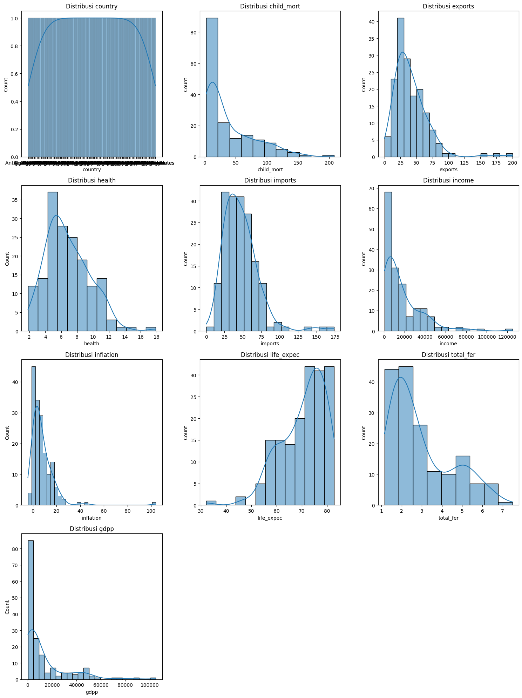

lalu ini menampilkan nilai rata-rata (mean) dari suatu dataset menggunakan library matplotlib dan seaborn di Python.
``` bash
fig,ax = plt.subplots(nrows = 1,ncols = 1,figsize = (5,5))

colors = ['#FF781F','#2D2926']
plt.subplot(1,1,1)
sns.heatmap(data.describe().T[['mean']],cmap = 'Oranges',annot = True,fmt = '.2f',linecolor = 'black',linewidths = 0.4,cbar = False);
plt.title('Mean Values');

fig.tight_layout(pad = 4)
```
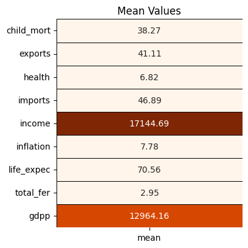

ini memunculkan hasil memisahkan dan menampilkan fitur kategorikal dan numerikal dari suatu DataFrame dalam Python, khususnya menggunakan library pandas.
``` bash
col = list(data.columns)
col.remove('country')
categorical_features = ['country']
numerical_features = [*col]
print('Categorical Features :',*categorical_features)
print('Numerical Features :',*numerical_features)
```

ini memunculkan visualisasi distribusi dari fitur-fitur numerikal dalam sebuah dataset menggunakan pustaka matplotlib dan seaborn di Python. 
``` bash
fig, ax = plt.subplots(nrows = 3,ncols = 3,figsize = (15,15))
for i in range(len(numerical_features)):
    plt.subplot(3,3,i+1)
    sns.distplot(data[numerical_features[i]],color = colors[0])
    title = 'Distribution : ' + numerical_features[i]
    plt.title(title)
plt.show()
```
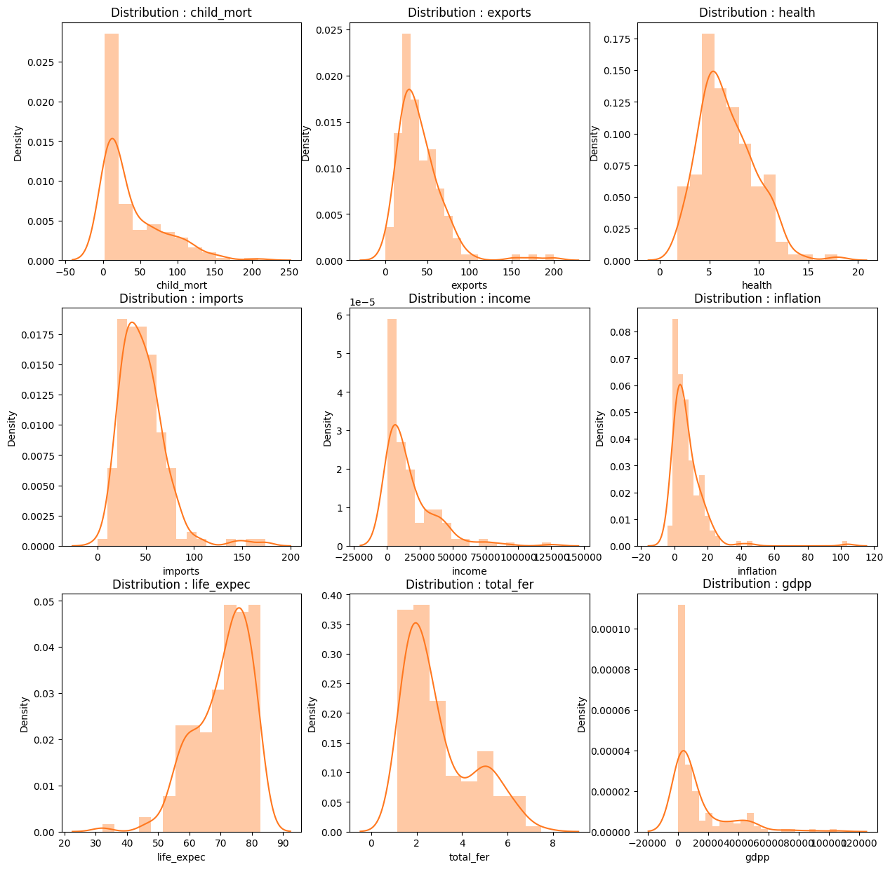

ini memunculkan visualisasikan matriks korelasi  DataFrame dalam dua format segitiga berbeda (atas dan bawah) menggunakan Matplotlib dan Seaborn.
``` bash
ut = np.triu(data.corr())
lt = np.tril(data.corr())

fig,ax = plt.subplots(nrows = 1, ncols = 2,figsize = (15,5))
plt.subplot(1,2,1)
sns.heatmap(data.corr(),cmap = colors,annot = True,cbar = 'True',mask = ut);
plt.title('Correlation Matrix : Upper Triangular Format');

plt.subplot(1,2,2)
sns.heatmap(data.corr(),cmap = colors,annot = True,cbar = 'True',mask = lt);
plt.title('Correlation Matrix : Lower Triangular Format');
```
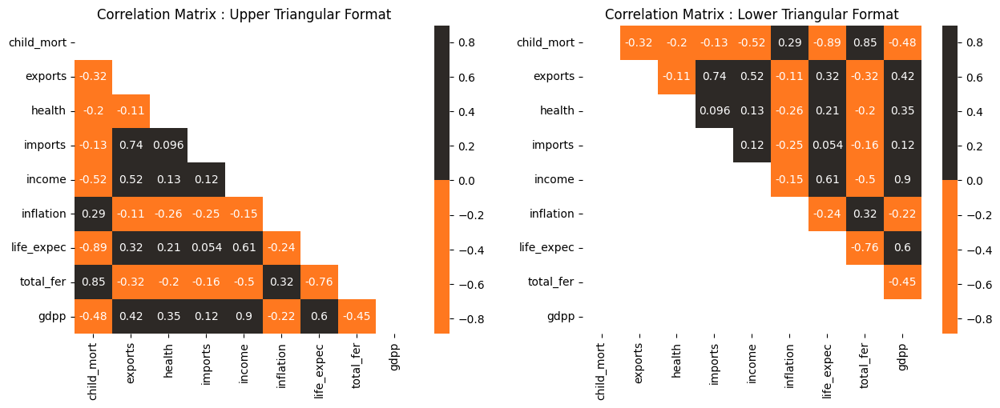

ini memunculkan serangkaian plot kotak untuk setiap fitur numerik dalam kumpulan data, disusun dalam kotak subplot 3x3 menggunakan Matplotlib dan Seaborn.
``` bash
fig  = plt.subplots(nrows = 3,ncols = 3,figsize = (15,15))
for i in range(len(numerical_features)):
    plt.subplot(3,3,i+1)
    ax = sns.boxplot(data[numerical_features[i]],color = colors[0])
    plt.title(numerical_features[i])
plt.show()
```
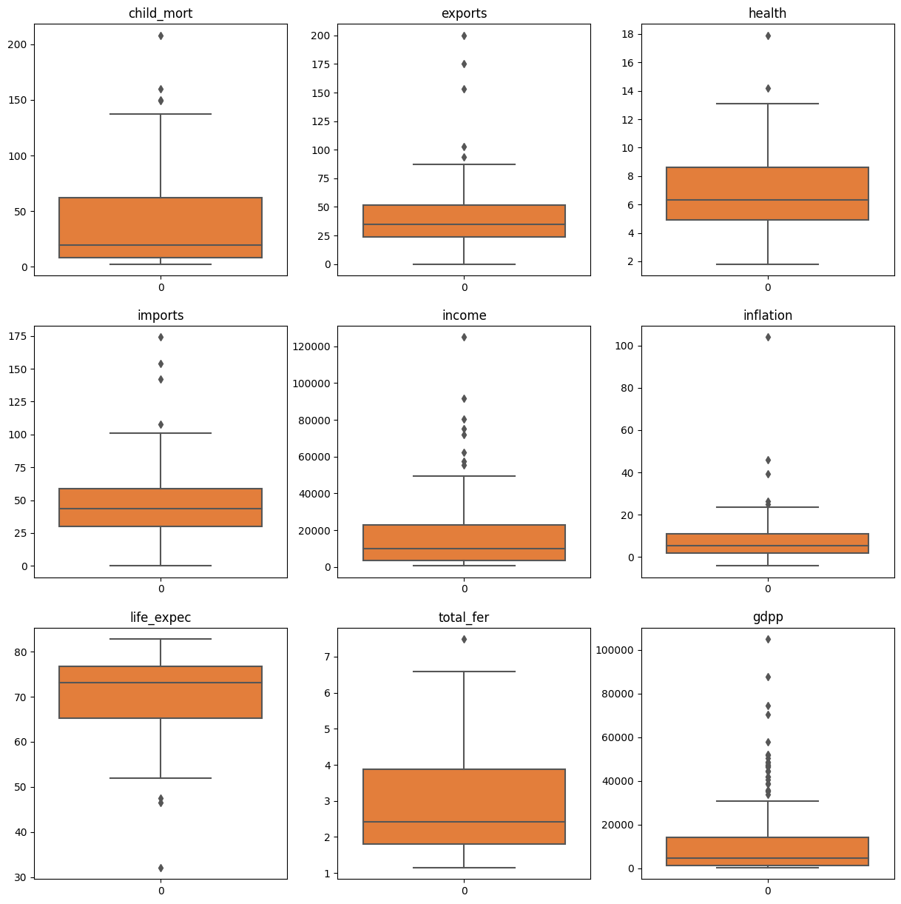
ini memunculkan representasi gaya matriks korelasi dari DataFrame, tidak termasuk kolom 'country'. Matriks korelasi secara visual mewakili koefisien korelasi antara setiap pasangan kolom numerik di DataFrame.

``` bash
corelation_matrix = data.drop(columns='country').corr()
corelation_matrix.style.background_gradient(cmap='coolwarm', axis=None).format(precision=2)
```
#### Data Preparation
rekayasa fitur (feature engineering), di mana fitur baru ('Health', 'Trade', dan 'Finance') dibuat dengan menggabungkan dan mentransformasi data yang ada.
``` bash
df1 = pd.DataFrame()
df1['Health'] = (data['child_mort'] / data['child_mort'].mean()) + (data['health'] / data['health'].mean()) + (data['life_expec'] / data['life_expec'].mean()) + (data['total_fer'] / data['total_fer'].mean())
df1['Trade'] = (data['imports'] / data['imports'].mean()) + (data['exports'] / data['exports'].mean())
df1['Finance'] = (data['income'] / data['income'].mean()) + (data['inflation'] / data['inflation'].mean()) + (data['gdpp'] / data['gdpp'].mean())
df1.head()
```

ini menambahkan kolom baru
``` bash
mms = MinMaxScaler() # Normalization
ss = StandardScaler() # Standardization

df1['Health'] = mms.fit_transform(df1[['Health']])
df1['Trade'] = mms.fit_transform(df1[['Trade']])
df1['Finance'] = mms.fit_transform(df1[['Finance']])
df1.insert(loc = 0, value = list(data['country']), column = 'Country')
df1.head()
```

membuat data lebih sesuai untuk beberapa algoritma machine learning yang peka terhadap skala fitur. 
``` bash
df2 = data.copy(deep = True)

col = list(data.columns)
col.remove('health'); col.remove('country')

df2['health'] = ss.fit_transform(df2[['health']]) # Standardization

for i in col:
    df2[i] = mms.fit_transform(df2[[i]]) # Normalization
df2.drop(columns = 'country',inplace = True)
df2.head()
```

 tujuan dari kode ini adalah untuk melakukan analisis PCA pada data dan memahami seberapa banyak informasi yang dapat dijelaskan oleh setiap komponen utama.
``` bash
pca = PCA()
pca_df2 = pd.DataFrame(pca.fit_transform(df2))
pca.explained_variance_
```
Grafik ini memberikan gambaran tentang seberapa banyak varian yang dapat dijelaskan oleh setiap komponen utama dan seberapa cepat kumulatif varian meningkat dengan menambahkan komponen utama baru. 
``` bash
plt.step(list(range(1,10)), np.cumsum(pca.explained_variance_ratio_))
plt.plot(np.cumsum(pca.explained_variance_ratio_))
plt.xlabel('Eigen Values')
plt.ylabel('Ratio of Variance Explained')
plt.title('Variance Covered by each Eigen Value')
plt.show()
```
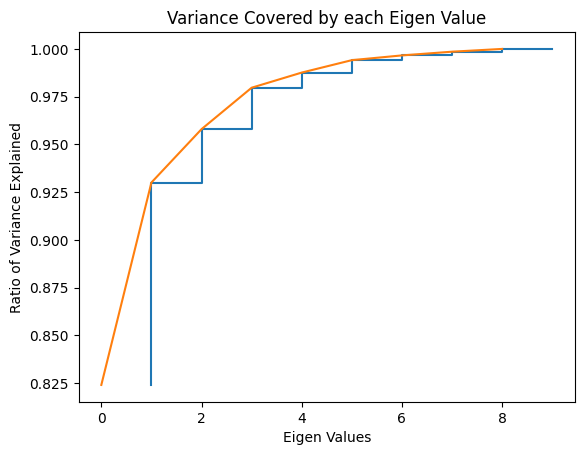
Kode yang Anda berikan melakukan operasi menghilangkan kolom tertentu dari DataFrame,yang kemungkinan besar berisi hasil transformasi PCA.
``` bash
pca_df2 = pca_df2.drop(columns = [3,4,5,6,7,8])
pca_df2.head()
```
####  Modeling
Kode ini menyiapkan dua set data, m1 dan m2, untuk digunakan dalam analisis atau pemodelan lebih lanjut. 
``` bash
m1 = df1.drop(columns = ['Country']).values # Feature Combination : Health - Trade - Finance
m2 = pca_df2.values # PCA Data
```
Kode ini melakukan dua metode evaluasi yang umum digunakan untuk menentukan jumlah optimal dari kluster dalam algoritma K-Means: metode Elbow dan metode Silhouette Score.
``` bash
sse = {};sil = [];kmax = 10
fig = plt.subplots(nrows = 1, ncols = 2, figsize = (20,5))

# Elbow Method :
plt.subplot(1,2,1)
for k in range(1, 10):
    kmeans = KMeans(n_clusters=k, max_iter=1000).fit(m1)
    sse[k] = kmeans.inertia_ # Inertia: Sum of distances of samples to their closest cluster center
sns.lineplot(x = list(sse.keys()), y = list(sse.values()));
plt.title('Elbow Method')
plt.xlabel("k : Number of cluster")
plt.ylabel("Sum of Squared Error")
plt.grid()

# Silhouette Score Method
plt.subplot(1,2,2)
for k in range(2, kmax + 1):
    kmeans = KMeans(n_clusters = k).fit(m1)
    labels = kmeans.labels_
    sil.append(silhouette_score(m1, labels, metric = 'euclidean'))
sns.lineplot(x = range(2,kmax + 1), y = sil);
plt.title('Silhouette Score Method')
plt.xlabel("k : Number of cluster")
plt.ylabel("Silhouette Score")
plt.grid()

plt.show()
```
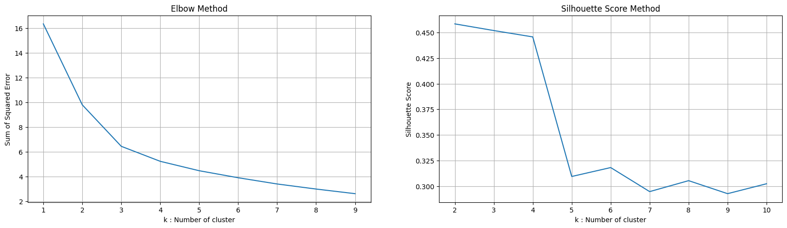

Plot ini memberikan visualisasi tentang seberapa baik algoritma K-Means membagi data ke dalam tiga kluster berdasarkan fitur-fitur 'Health', 'Trade', dan 'Finance'. 
``` bash
model = KMeans(n_clusters = 3,max_iter = 1000)
model.fit(m1)
cluster = model.cluster_centers_
centroids = np.array(cluster)
labels = model.labels_
data['Class'] = labels; df1['Class'] = labels

fig = plt.figure()
ax = Axes3D(fig)
x = np.array(df1['Health'])
y = np.array(df1['Trade'])
z = np.array(df1['Finance'])
ax.scatter(centroids[:,0],centroids[:,1],centroids[:,2],marker="X", color = 'b')
ax.scatter(x,y,z,c = y)
plt.title('Health vs Trade vs Finance')
ax.set_xlabel('Health')
ax.set_ylabel('Trade')
ax.set_zlabel('Finance')
plt.show();
```

Kode ini untuk membuat peta choropleth yang menunjukkan kategori kluster atau label hasil dari algoritma K-Means untuk setiap negara.
``` bash
df1['Class'].loc[df1['Class'] == 0] = 'No Help Needed'
df1['Class'].loc[df1['Class'] == 1] = 'Help Needed'
df1['Class'].loc[df1['Class'] == 2] = 'Might Need Help'

fig = px.choropleth(df1[['Country','Class']],
                    locationmode = 'country names',
                    locations = 'Country',
                    title = 'Needed Help Per Country (World)',
                    color = df1['Class'],
                    color_discrete_map = {'Help Needed':'Red',
                                        'No Help Needed':'Green',
                                        'Might Need Help':'Yellow'}
                   )
fig.update_geos(fitbounds = "locations", visible = True)
fig.update_layout(legend_title_text = 'Labels',legend_title_side = 'top',title_pad_l = 260,title_y = 0.86)
fig.show(engine = 'kaleido')
```
Kode ini menggunakan algoritma Nearest Neighbors dari scikit-learn untuk menghitung jarak antara setiap titik dalam dataset `m1` ke 7 tetangga terdekatnya (7-NN) dan kemudian membuat grafik untuk memvisualisasikan jarak ini. 
``` bash
knn = NearestNeighbors(n_neighbors = 7)
model = knn.fit(m1)
distances, indices = knn.kneighbors(m1)
distances = np.sort(distances, axis=0)
distances = distances[:,1]
plt.grid()
plt.plot(distances);
plt.xlabel('Points Sorted by Distance')
plt.ylabel('7-NN Distance')
plt.title('K-Distance Graph');
```
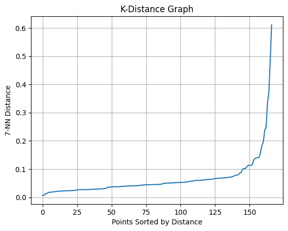
Kode ini menggunakan algoritma DBSCAN (Density-Based Spatial Clustering of Applications with Noise) untuk mengelompokkan data dalam m1 menjadi kluster dan menentukan label kluster untuk setiap titik data. 
``` bash
db = DBSCAN(eps = 0.080, min_samples = 8).fit(m1)
core_samples_mask = np.zeros_like(db.labels_, dtype=bool)
core_samples_mask[db.core_sample_indices_] = True
labels = db.labels_

# Number of clusters in labels, ignoring noise if present

n_clusters_ = len(set(labels)) - (1 if -1 in labels else 0)
n_noise_ = list(labels).count(-1)
print('Number of Clusters : ', n_clusters_)
print('Number of Outliers : ', n_noise_)

data['Class'] = labels; df1['Class'] = labels
```
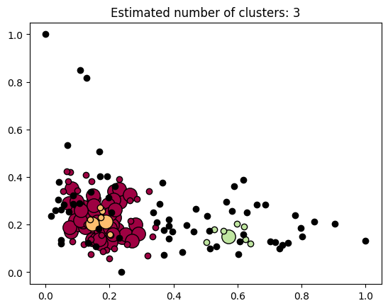
Kode ini menggambarkan hasil klasterisasi yang dilakukan oleh algoritma DBSCAN pada data m1.
``` bash
unique_labels = set(labels)
colors = [plt.cm.Spectral(each) for each in np.linspace(0, 1, len(unique_labels))]
for k, col in zip(unique_labels, colors):
    if k == -1:
        # Black used for noise.
        col = [0, 0, 0, 1]
    class_member_mask = labels == k

    xy = m1[class_member_mask & core_samples_mask]
    plt.plot(xy[:, 0], xy[:, 1], "o", markerfacecolor = tuple(col), markeredgecolor = "k", markersize = 14)

    xy = m1[class_member_mask & ~core_samples_mask]
    plt.plot(xy[:, 0], xy[:, 1], "o", markerfacecolor = tuple(col), markeredgecolor = "k", markersize = 6)

plt.title("Estimated number of clusters: %d" % n_clusters_)
plt.show()
```
Kode ini menggunakan label kluster hasil dari algoritma DBSCAN untuk mengelompokkan negara-negara dalam DataFrame `df1` ke dalam kategori tertentu. 
``` bash
df1['Class'].loc[df1['Class'] == -1] = 'Noise / Outliers'
df1['Class'].loc[df1['Class'] == 0] = 'Might Need Help'
df1['Class'].loc[df1['Class'] == 1] = 'No Help Needed'
df1['Class'].loc[df1['Class'] == 2] ='Help Needed'

fig = px.choropleth(df1[['Country','Class']],
                    locationmode = 'country names',
                    locations = 'Country',
                    title = 'Needed Help Per Country (World)',
                    color = df1['Class'],
                    color_discrete_map={'Noise / Outliers' : 'Black',
                                        'Help Needed':'Red',
                                        'Might Need Help':'Yellow',
                                        'No Help Needed':'Green'})
fig.update_geos(fitbounds = "locations", visible = True)
fig.update_layout(legend_title_text = 'Labels',legend_title_side = 'top',title_pad_l = 260,title_y = 0.86)
fig.show(engine = 'kaleido')
```

## Evaluation
Disini saya menggunakan k-mean.
- K-Means Clustering merupakan algoritma yang efektif untuk menentukan cluster dalam sekumpulan data, di mana pada algortima tersebut dilakukan analisis kelompok yang mengacu pada pemartisian N objek ke dalam K kelompok (Cluster) berdasarkan nilai rata-rata (means) terdekat.seperti berikut:
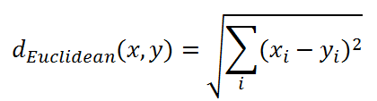
- Principal component analysis (PCA) adalah suatu teknik analisis yang digunakan dalam bidang statistika dan juga data science.:

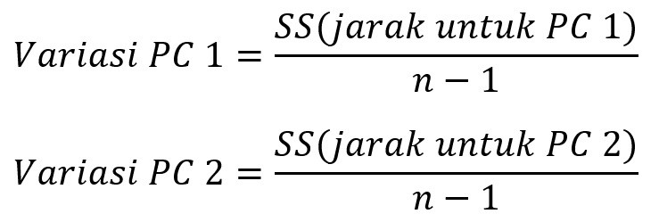


## Deployment

[Unsupervised Learning on Country Data](https://pankmean.streamlit.app/).

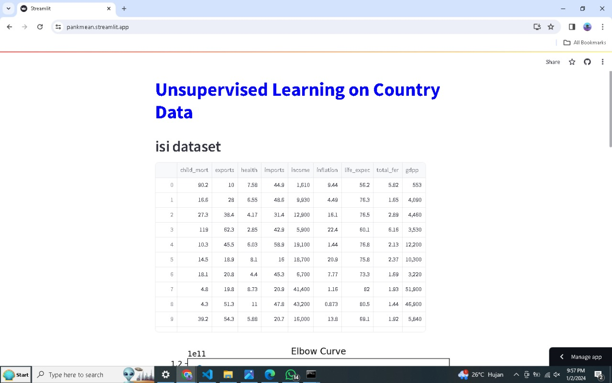
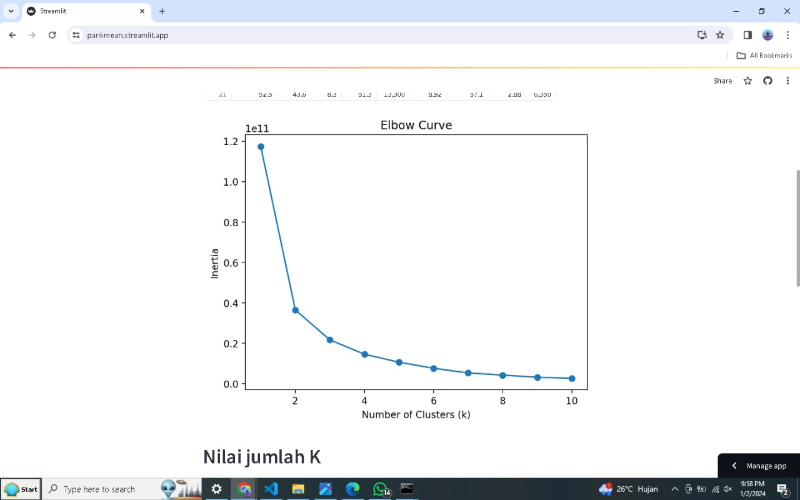
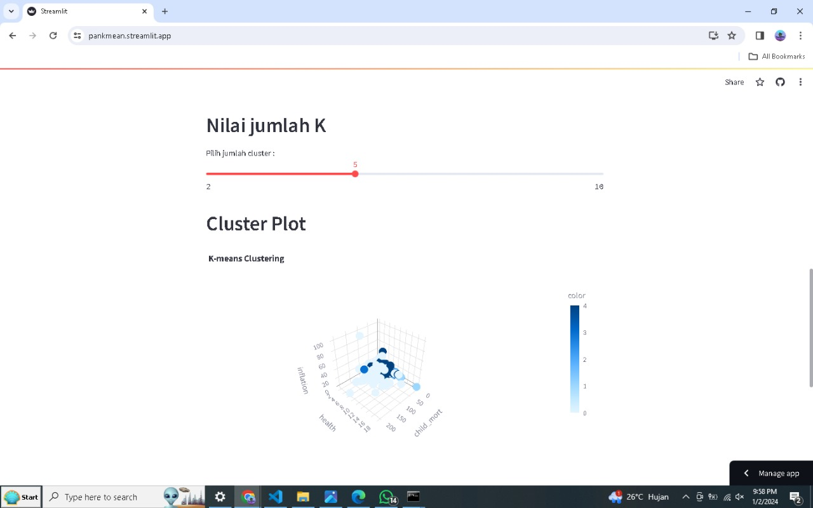
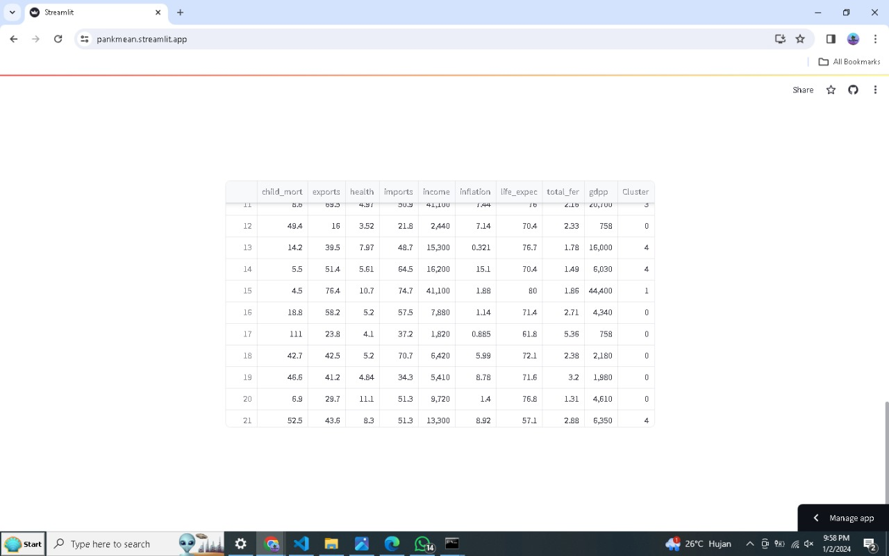